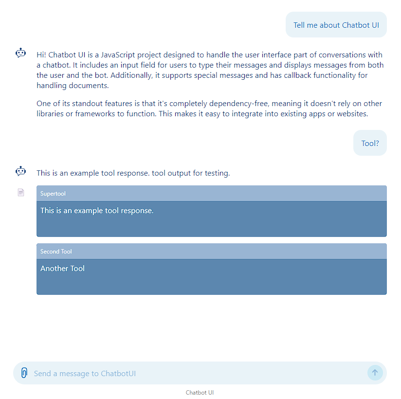

# Chatbot UI

A dependency free chatbot ui.

While developed by prognosticians, chatbotui is not an official
prognostica product.

## Features

- User message input (chatbar)
  - Input is converted to plain text
- Message output
  - Customizable render function (e.g., markdown-it) for displaying messages
  - Messages can be built from chunks, supporting streaming responses
  - Displays tool output alongside conversational messages
- Files
  - Files can be attachted via button or drag-and-drop
- Styling
   - Customizable styling via CSS variables

## When to Consider Using Chatbot UI

Use Chatbot UI when you need to present an existing chatbot API endpoint in the browser.

## What Chatbot UI is Not

Chatbot UI does not include built-in logic for generating messages or message
chunks. You need to implement your own logic to fetch data from an API and
convert the responses into Chatbot UI classes. However, there is an example
project available that includes a FastAPI project along with the necessary glue
logic to help you get started.



## Build

```bash
npm install --include=dev --ignore-scripts
npm run build
```

### Types

```bash
npm install typescript --no-save
npx -p typescript tsc src/**/*.js --declaration --allowJs --emitDeclarationOnly --outDir types
```

## License

This project is licensed under the MIT License - see the [LICENSE](LICENSE) file for details.

## Contributing

By submitting a contribution (code, documentation, or other content), you agree
that your contribution is licensed under the MIT License as stated in the
LICENSE file of this project. For more details, please see our
[CONTRIBUTING](CONTRIBUTING.md) guidelines.
